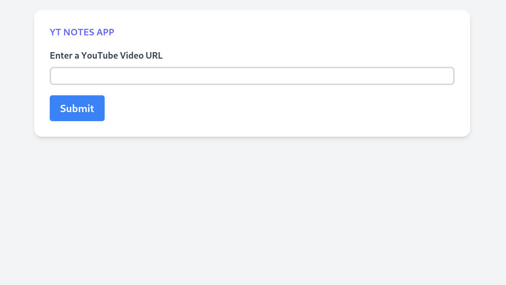

## Technical Requirements
- Python : 3.10 or higher
- SQLite

## Installation
To install the application, follow these steps:

1. Clone the repository:
   ```bash
   git clone https://github.com/udit-001/yt-notes.git
   ```
2. Change into the project directory:
   ```bash
   cd yt-notes
   ```
3. Create a virtual environment:
   ```bash
   python3 -m venv venv
   ```
4. Activate the virtual environment:
   ```bash
   source venv/bin/activate
   ```
5. Install the required packages:
   ```
   pip install -r requirements.txt
   ```
6. Run the Django migrations:
   ```
   python manage.py migrate
   ```
7. Start the Django development server:
   ```
   python manage.py runserver
   ```
8. To get started, please open your web browser and navigate to `http://localhost:8000`

   Once you're there, you'll be able to interact with the application by entering a YouTube video link in the provided input field. The video will then load, and you can start adding notes as you watch.

   

## Running Tests

To run the tests for the application, use the following command:
```
python manage.py test app
```

## API Documentation

Once you're got the application running, you can view the API docs for this app by visiting http://localhost:8000/api/docs/

### API Endpoints

The following API endpoints are available:

#### Create a new video

To create a new video, send a POST request to `/api/videos/` with the following payload:

```json
{
    "title": "Video title",
    "url": "https://www.youtube.com/watch?v=ABCDEFGHIJ",
    "duration": 120
}
```

Note:
- The url field must be a valid YouTube URL.
- The duration field must be an integer representing the length of the video in seconds.


* `/api/videos/` (POST): Create a new video for the current session
* `/api/videos/<int:pk>/notes/` (GET, POST): List all notes for a video or create a new note.


#### Create a new note
To create a new note, send a POST request to `/api/videos/<int:pk>/notes/` with the following payload:

```json
{
  "content": "Note content",
  "timestamp": 12345
}
```

Note:
- The timestamp field is an integer representing a point in time in the video where the note was added, it should be less than or equal to the duration of the video.
- `<int:pk>` is the id of the video returned by the `/api/videos/` endpoint as response. Eg: `/api/videos/3/notes/`

#### List all videos
To view all the videos stored by a user, make a GET request to `/api/videos/`.

#### List all notes for a video
To view all the notes associated with a specific video, make a GET request to `/api/videos/<int:pk>/notes/`, where `<int:pk>` is the ID of the video.

Note:
- Ordering based on timestamp and creation time is supported for the notes list API.
- All list endpoints support Limit and Offset pagination.


## Technologies Used
- [Django](https://www.djangoproject.com/)
- [Django Rest Framework](https://www.django-rest-framework.org/)
- [DRF Spectacular](https://drf-spectacular.readthedocs.io/)
- SQLite
- [Tailwind](https://tailwindcss.com/)
- JavaScript
- [YouTube Iframe API](https://developers.google.com/youtube/iframe_api_reference) : Used for interacting with the YouTube Embed and getting the current timestamp while storing notes.
